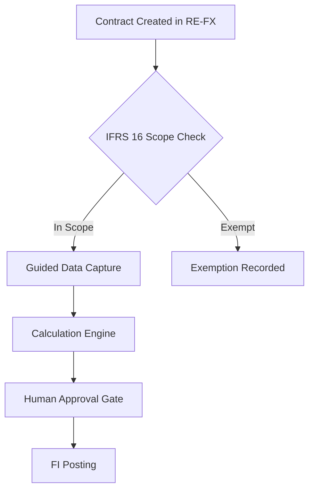

# Documentation Policy — RE-SAP IFRS 16 Addon

## Core Principle
Documentation is not a deliverable — it is a **property of the system**. Every change to requirements, design, or implementation must be reflected in the relevant documentation before that change is considered complete. A task is never "done" if its documentation has not been updated.

---

## Mandatory Documentation Updates per Iteration

Every iteration (sprint, feature, or bug fix) must produce the following documentation updates where applicable:

| Change Type | Required Documentation Update |
|-------------|-------------------------------|
| New requirement or epic | `specs/000-master-ifrs16-addon/requirements.md` updated with story and AC |
| New functional design decision | `docs/functional/master-functional-design.md` updated |
| New technical design decision | `docs/technical/master-technical-design.md` updated |
| New Z object proposed or created | `docs/technical/master-technical-design.md` — object catalog updated |
| User workflow changed | `docs/user/master-user-manual.md` updated |
| ADR approved | `docs/governance/decision-log.md` entry added |
| New risk identified | `docs/governance/risk-register.md` entry added |
| New assumption made or validated | `docs/governance/assumptions-register.md` updated |
| New knowledge source added | Corresponding `knowledge/[folder]/README.md` updated |
| Any AI agent behavior changed | `AGENTS.md` or relevant agent JSON updated |
| Steering policy changed | Relevant `.kiro/steering/` file updated |

---

## Functional, Technical, and User Documentation Alignment

These three documents are **synchronized views of the same system**:
- `docs/functional/master-functional-design.md` — *what the system does* (business perspective)
- `docs/technical/master-technical-design.md` — *how the system does it* (technical perspective)
- `docs/user/master-user-manual.md` — *how users interact with it* (operational perspective)

A change to any one of these documents must trigger a review of whether the other two need corresponding updates. The agent responsible for a change must explicitly confirm: "Functional/Technical/User doc alignment checked — [updated/no update needed]."

---

## Release Note Expectations

At the end of each delivery phase or major iteration:
- A release note section must be added to `docs/governance/decision-log.md` summarizing:
  - Features delivered.
  - Known limitations.
  - Changes to user workflow.
  - Outstanding open items.
  - Dependencies or prerequisites for next phase.
- The release note must be dated and reference the spec tasks that were completed.

---

## Traceability to Specs and Decisions

Every section of `docs/functional/` and `docs/technical/` must carry a traceability footer:

```
---
Traceability:
- Spec: specs/000-master-ifrs16-addon/requirements.md — Epic [N], Story [M]
- Decision: docs/governance/decision-log.md — ADR-[NNN]
- Last updated: YYYY-MM-DD
- Updated by: [Human name or Agent name]
---
```

This footer must be updated every time a section is modified.

---

## Diagram Expectations

- **Architecture diagrams** (system context, component, sequence): Required in `docs/technical/master-technical-design.md`. Must be updated when component structure changes.
- **Process flow diagrams** (business process, decision flows): Required in `docs/functional/master-functional-design.md`. Must be updated when process changes.
- **User flow diagrams** (screen flows, guided steps): Required in `docs/user/master-user-manual.md` for complex workflows.
- **Diagram format:** Mermaid preferred for simple diagrams embedded in Markdown. draw.io (with exported PNG) for complex diagrams.
- **Diagram version:** Every diagram must include a version date in its caption.

Example Mermaid diagram in a spec:


---

## Style Rules

1. **Language:** All documentation is in English. Spanish is used only in the `BOOTSTRAP_SUMMARY.md` (bilingual).
2. **Tone:** Professional, operational, precise. No marketing language. No vague statements like "the system should be able to."
3. **Active voice:** "The system calculates the lease liability" — not "The lease liability is calculated by the system."
4. **Tables over prose:** Use Markdown tables for lists of items with multiple attributes.
5. **Concrete examples:** Every rule must have at least one concrete example where the rule applies.
6. **No placeholders left open:** Every `[TO BE CONFIRMED]` item must have an owner and a target resolution date. Do not leave TBCs without owners.
7. **Version header:** Every master document must carry a version header at the top:
   ```
   | Version | Date | Author | Summary |
   |---------|------|--------|---------|
   | 0.1 | 2026-03-24 | [Author] | Initial bootstrap |
   ```
8. **Heading hierarchy:** H1 for document title, H2 for major sections, H3 for subsections. Never skip levels.
9. **Cross-references:** Always use relative file paths for cross-references between docs (e.g., `[decision-log](../governance/decision-log.md)`).
10. **Deprecation:** When a section becomes obsolete, do not delete it — mark it `[DEPRECATED — see ADR-NNN]` and add a reference to the replacement.
